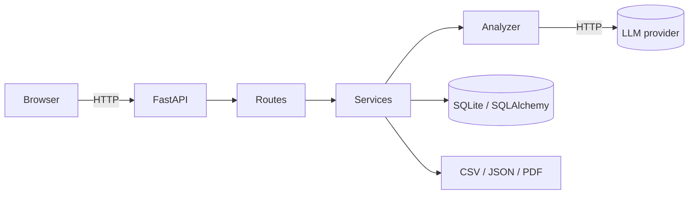

# InsightLoop — Architecture

This document describes the internals of InsightLoop. It is aimed at
contributors and integrators who want to understand how the pieces fit together.

## High-level



The codebase is intentionally flat. A request never crosses more than three
modules before it hits the database or the LLM.

## Modules

| Path | Role |
|---|---|
| `main.py` | Uvicorn entry point + FastAPI app factory. |
| `app/config.py` | `pydantic-settings` configuration, env-driven. |
| `app/database.py` | SQLAlchemy engine, session factory, `init_db`, `get_db`. |
| `app/models.py` | ORM: `Feedback` and `Analysis`. |
| `app/schemas.py` | Pydantic DTOs for the HTTP layer. |
| `app/security.py` | Bearer/API key auth, signed browser sessions, and CSRF checks for mutating routes. |
| `app/templating.py` | Shared `Jinja2Templates` instance. |
| `app/ai/base.py` | `LLMClient` ABC, `LLMResponse`, JSON parser. |
| `app/ai/openai_client.py` | OpenAI Chat Completions adapter (JSON mode). |
| `app/ai/anthropic_client.py` | Anthropic Messages adapter (tool use). |
| `app/ai/ollama_client.py` | Local Ollama adapter (`/api/chat`). |
| `app/ai/mock_client.py` | Offline, deterministic adapter. |
| `app/ai/factory.py` | Builds the right adapter from settings. |
| `app/analyzer.py` | Orchestrates LLM call + DB persistence. |
| `app/services/feedback_service.py` | CRUD + CSV ingest. |
| `app/services/insights_service.py` | Aggregations: summary, trends, topics, urgent. |
| `app/services/report_service.py` | CSV / JSON / PDF generation. |
| `app/routes/pages.py` | HTML pages (Jinja2). |
| `app/routes/api_feedback.py` | JSON feedback API. |
| `app/routes/api_insights.py` | JSON insights API. |
| `app/routes/api_reports.py` | Report downloads. |

## Data flow: analyze one piece of feedback

```
POST /api/feedback
  → require_write_auth (Bearer/API key or browser session + CSRF)
  → api_feedback.create_feedback
  → analyzer.analyze_and_persist
       ├─ INSERT feedback row
       ├─ LLMClient.analyze_feedback(text)
       │     └─ provider-specific HTTP call → returns JSON
       ├─ parse_payload (normalize & clamp)
       └─ INSERT analysis row
  → FeedbackOut JSON
```

Read-only endpoints are public. Mutating endpoints (`POST /api/analyze`,
`POST /api/feedback`, `POST /api/feedback/bulk`, `DELETE /api/feedback/{id}`)
fail closed unless `INSIGHTLOOP_API_KEY` or `ADMIN_PASSWORD` is configured.
REST clients authenticate with a Bearer token or `X-InsightLoop-API-Key`.
Browser writes use a signed session cookie plus `X-CSRF-Token`.

## Data model

```
Feedback (1) ──< (0..1) Analysis
   id, text, source, customer_email, created_at
                                      ↘
                                  Analysis
                                     id, sentiment, score, topics (JSON),
                                     urgency, summary, suggested_actions (JSON),
                                     raw_response (JSON), provider, model,
                                     created_at
```

## Provider abstraction

All providers inherit from `LLMClient` and implement one method:

```python
def analyze_feedback(self, text: str) -> LLMResponse
```

The contract for the response is enforced by the base-class parser
(`parse_payload`): it tolerates code fences, clamps out-of-range values, and
fills defaults. This means you can plug in a new provider with minimal effort
as long as its output contains a JSON object with the documented keys.

## Configuration

`app/config.py` uses `pydantic-settings` with `case_sensitive=False`. Every
env var documented in `.env.example` is mapped to a typed field. The instance
is cached with `functools.lru_cache` so it is built exactly once per process.

## Why SQLite by default

- Zero configuration: no separate service to run.
- Easy to swap: change `DATABASE_URL` to point at Postgres/MySQL and the SQL
  in this project (basic CRUD + aggregations) keeps working.

For very large workloads switch the `DATABASE_URL` to a managed Postgres
instance and add an index on `analysis.urgency` and a GIN index on
`analysis.topics` for fast topic queries.
